# Ecommerce - Introduction

Project milestone 4 for Code Institute Full-stack development program.
This project is a Full Stack website built using the Django framework. Ecommerce is a platform that provides user solution so that they will be able to buy online with all the ecommerce capabilities. The website is fully functional with logged in users and guest user checkout capabilities. Guest users will have the ability to check out with cookies set up.
It is believed that a good website  should always give user  the ability to checkout without creating an account. Cookies helps us make this a possibility.
The user of the website each will have different experience based, whether the user is a visitor[can see products, can navigate through the items, search and see what is there, can go to cart]. a registered user has different experience which is everything non registered user has plus, car manipulation capabilities, checkout capalities and super user is the admin which has every capapbility that the registered user has plus being able to perform site management capabilities. 

[Live Project Here](https://tadichaecommercestore-6c140a2ed1bd.herokuapp.com/)

The projects responsiveness is checked agains large and small screen of different size to see responsiveness. As an example one small screen responsiveness and one bigger screen responsiveness is provided in the Rmd below.

[Responsiveness can be found here](RESPONSIVE.md)

README Table of Content

- [Ecommerce - Introduction](#Ecommerce---Introduction)
  - [User Experience - UX](#user-experience---ux)
    - [User Stories](#user-stories)
    - [Agile Methodology](#agile-methodology)
    - [The Scope](#the-scope)
      - [Main Site Goals](#main-site-goals)
  - [Design](#design)
      - [Colours](#colours)
      - [Typography](#typography)
      - [Imagery](#imagery)
    - [Wireframes](#wireframes)
  - [Database Diagram](#database-diagram)
  - [Features](#features)
    - [Search Box](#search-box)
    - [Search Results Page](#search-results-page)
    - [Search Results - Input Empty](#search-results---input-empty)
    - [Search Results - No Results Found](#search-results---no-results-found)
    - [Signup Page](#signup-page)
    - [Login Page](#login-page)
    - [Navbar](#navbar)
  - [Admin Panel/Superuser](#admin-panelsuperuser)
  - [Technologies Used](#technologies-used)
    - [Languages Used](#languages-used)
      - [Django Packages](#django-packages)
    - [Frameworks - Libraries - Programs Used](#frameworks---libraries---programs-used)
    - [Testing](#testing)
  - [Creating the Django app](#creating-the-django-app)
  - [Deployment of This Project](#deployment-of-this-project)
  - [Final Deployment](#final-deployment)
  - [Forking This Project](#forking-this-project)
  - [Cloning This Project](#cloning-this-project)
  - [Credits](#credits)
    - [Content](#content)
    - [Information Sources / Resources](#information-sources--resources)
  - [Special Thanks](#special-thanks)

## User Experience - UX

### User Stories

* As a website visitor, I can:

1. Navigate around the site and easily view the desired content.
2. View a list of available products to purschase and choose accordingly.
3. Search for products.
4. can add products to cart and remove accordingly.
5. I can view cart and see the totals in the cart page.
6. I can sign-up to make purchase

* As logged in user, I can:

1. Navigate around the site and easily view the desired content.
2. View a list of available products to purschase and choose accordingly.
3. Search for products.
4. can add products to cart and remove accordingly.
5. I can view cart and see the totals in the cart page.
6. I can control number of contents with the upward and downward arrow to add or reduce the number of products from cart page.
7. I can checkout and fillin correct address in the checkout section, without having to fill my already available login information.
8. I can log in

* As a website superuser, I can:

1. Create and post new products.
2. I can control user access.
3. Create a new user tied to a customer instance.
4. Delete user, products and change prices.
5. Change the website permissions for a user.
6. Navigate around the site and easily view the desired content.
7. View a list of available products to purschase and choose accordingly.
8. Search for products.
9. can add products to cart and remove accordingly.
10. I can view cart and see the totals in the cart page.
11. I can edit product names, prices and images
12. I can perfrom CRUD operation in the site

### Agile Methodology

All functionality and development of this project were managed using GitHub which Projects can be found
[here](https://github.com/htadicha/ecommerce/issues)

### The Scope

#### Main Site Goals

* To provide users with a good experience when using the ecommerce website.
* To provide users with a visually pleasing website that is intuitive to use and easy to navigate.
* To provide a website with a clear purpose.
* To provide role-based permissions that allows user to interact with the website with signed user having an additional layer of advantage of easily checking out.
* To provide tools that allow users to search for products through our search button.

#### Additional functionality provided by the site

- **Product Listing and Sales:** Display various products (e.g., electronics, shoes, shirts, accessories) that users can browse, search for, and purchase.

- **User Authentication:** Allow users to sign up, log in, and log out. After authentication, users can manage their shopping activities, such as adding/removing items from their cart.

- **Cart Management for registered Users:** Enable registered users to add items to a cart, review them, adjust quantities, and remove items.

- **Checkout Process for registered Users:** Allow users to proceed to checkout, where they can finalize their orders and make payments.

- **Search Functionality:** Provide a search feature for users(both guest and registered) to find products. If a product isn’t found, an appropriate message will be displayed.
- **User Data Management:** Safeguard user data and ensure smooth navigation through features like customer profiles and order history by the admin panel.

## Design
#### Colours

* The colour scheme is kept simple by opting for a combination of black set against the image
background and black text against the white background. For the navbar was set as a light green background
with yellow stripes on login/signup button and and green used in the seach border with white in the search bar.
The sign in and login page has blue button and hperlink of blue with black and whiel background with black text set against white background.

#### Typography

* The 'Poppins', sans-serif is used as the main font for the whole project and with default bootstrap theme used for the most of the part of the texts.

#### Imagery

* All the imagery is related to the products and website design with functionality built in the store template.Images are uploaded by admin upon product creation

### Wireframes

Wireframes for this project can be located [here](WIREFRAMES.md)

## Database Diagram

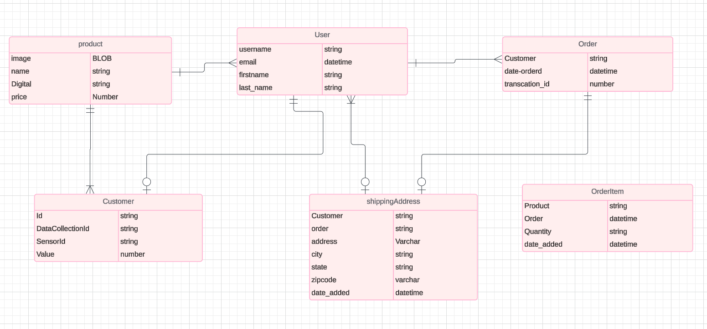 

## Features

###  Navigation 

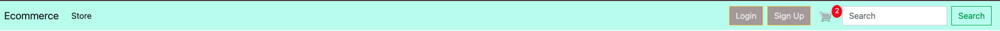

* The navigation has the name of the dashboard and **link** to the store and hyperlinked, login and signup button and a cart icon hperlinked to cart page

### Search Box

* In this box, the users can search by inputting a keyword in the search tool. This allows the user to try and find the products they are looking for.

### Search Results Page
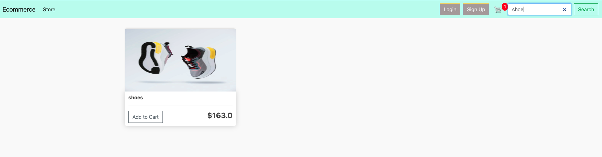

* On the Search Results Page, users can see the products found by their search.  When their product is  located

### Search Results - No Results Found
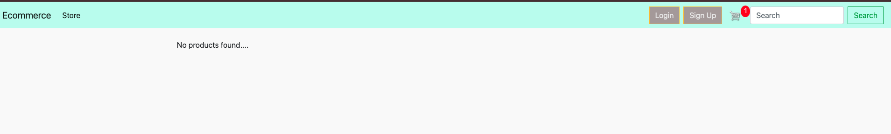

* On the Search Results Page - No Results Found, users will see this message if there is nothing found for the search.

 ## Login and Signup Pages
**Login:** Allows existing users to sign in with their credentials to access personalized features like managing their cart.
**Signup:** Enables new users to create an account by providing basic information (name, email, and password).
Form validation: Ensures that users enter valid information during login or signup.

### Signup Page

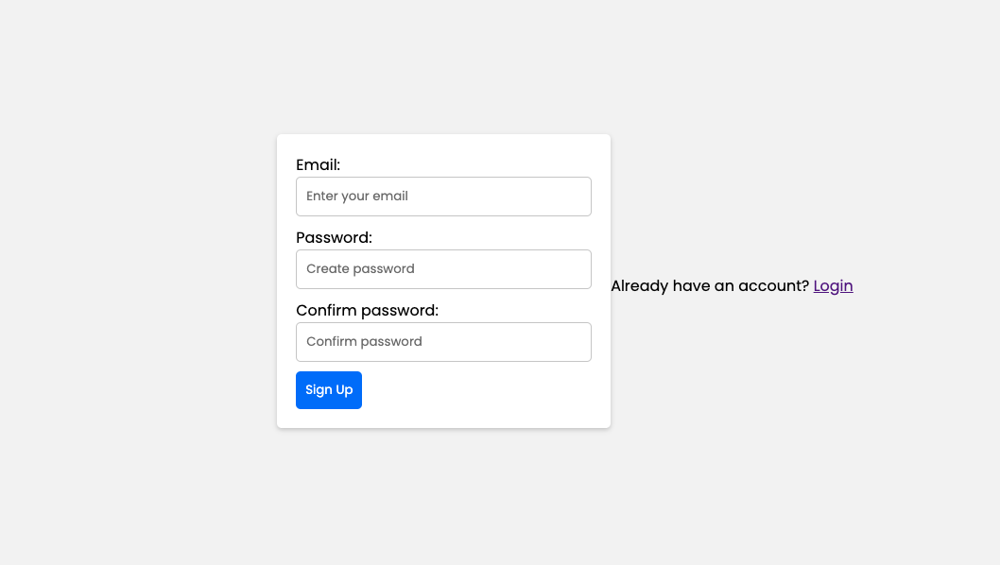

* On the Signup Page, a new user can sign up for the the ecommerce website by filling out and then submitting the form.

### Login Page

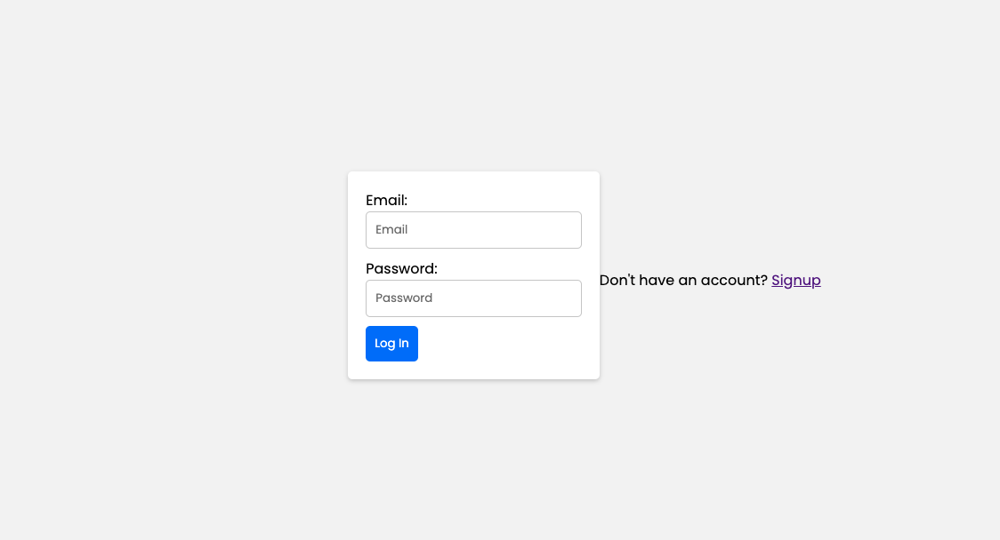

* On the Login Page, users can log in to the website by inputting the username and password and have accessto website services for a user registered which will give them the ability to add to cart and remove items from cart.

### Cart Page
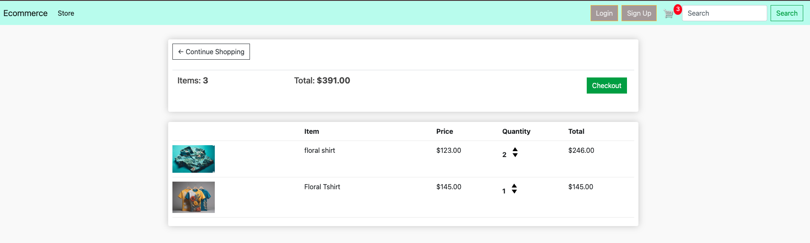
**View cart items:** Displays all the items the user has added to their cart, including quantities and total prices.
**Update cart:** Allows users to modify the quantity of items in the cart through updown arrow.
**View cart totals:** Shows the total number of items and the total cost of the items in the cart.

## Checkout Page
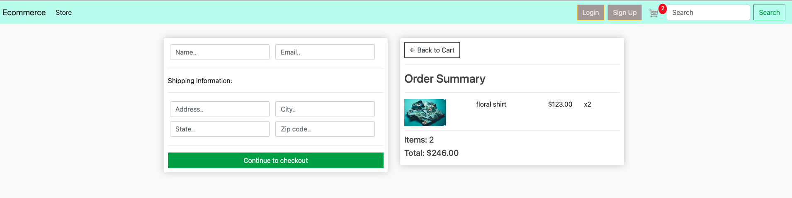
**Review order:** Displays a summary of the cart with items, quantities, and total cost.
**Enter shipping details:** Provides a form for users to input shipping information.
**Complete purchase:** Confirms the order and processes payment, marking the order as complete.
**Be able to go back to cart** allows functionality to be able to go back to cart to update orderItems

### Store page

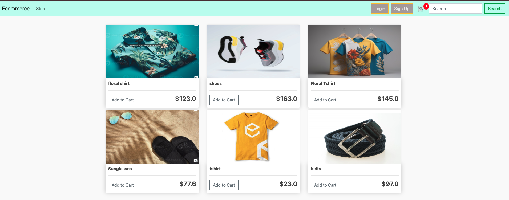

**Product Display:** Lists all available products in the store, showing key details such as the product name, price, and image.
**Add to Cart:** Allows users to add products to their cart. For authenticated users, items are added to their account's cart. For non-logged-in users, a temporary cart is created using cookies.
**Product Details:** displaying product price, name and images

### Navbar

* The navigation bar is present at the top of every page and houses all links to the various other pages.
* The options to Register or Log in will change to the option to log out once a user has logged in.
* Once a user has signed in, more options such as profile page and user image will be available in the navbar.
* A search icon is nested in the navbar and once clicked it will open the search box.
* The navbar is fully responsive, collapsing into a hamburger menu when the screen size becomes smaller.

## Admin Panel/Superuser
**Product management:** Admin can add, update, or delete products in the store.
**Order management:** Admin can view, edit, or complete customer orders.
**Customer management:** Admin can view and manage customer information and associated orders.
#### admin creating items

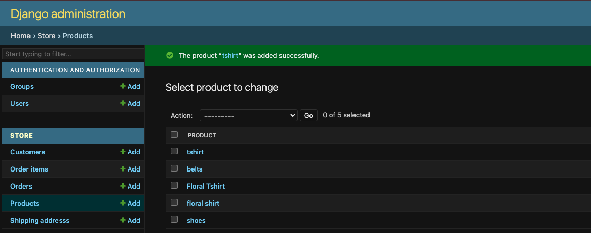
#### admin creating items
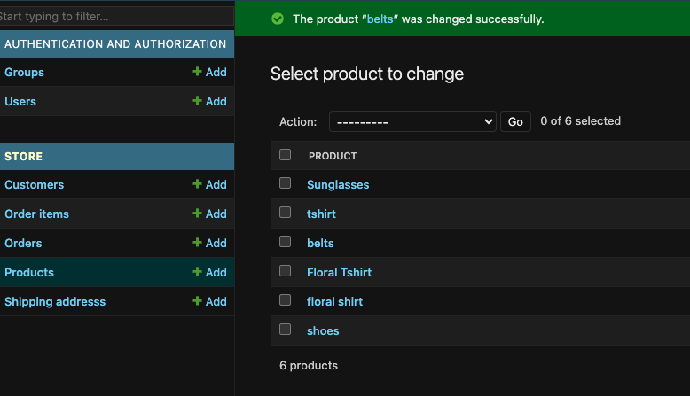
#### admin update items
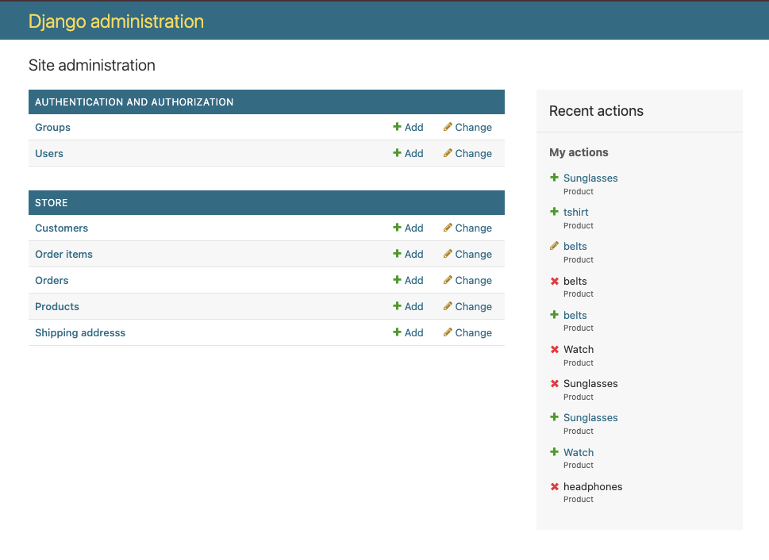

## Technologies Used

### Languages Used

* [HTML 5](https://en.wikipedia.org/wiki/HTML/)
* [CSS 3](https://en.wikipedia.org/wiki/CSS)
* [JavaScript](https://www.javascript.com/)
* [Django](https://www.python.org/)
* [Python](https://www.djangoproject.com/)

#### Django Packages

* [Gunicorn](https://gunicorn.org/) 
   As the server for Heroku
* [Cloudinary](https://cloudinary.com/) 
   Was used to host the static files and media
* [Dj_database_url](https://pypi.org/project/dj-database-url/) 
   To parse the database URL from the environment variables in Heroku
* [Psycopg2](https://pypi.org/project/psycopg2/) 
   As an adaptor for Python and PostgreSQL databases
* [Summernote](https://summernote.org/) 
   As a text editor
* [Allauth](https://django-allauth.readthedocs.io/en/latest/installation.html) 
   For authentication, registration, account
   management
* [Crispy Forms](https://django-crispy-forms.readthedocs.io/en/latest/) 
   To style the forms

### Frameworks - Libraries - Programs Used

* [Bootstrap](https://getbootstrap.com/) 
   Was used to style the website, add responsiveness and interactivity
* [Jquery](https://jquery.com/) 
   All the scripts were written using jquery library
* [Git](https://git-scm.com/) 
   Git was used for version control by utilizing the Gitpod terminal to commit to Git and push to GitHub
* [GitHub](https://github.com/) 
   GitHub is used to store the project's code after being pushed from Git
* [Heroku](https://id.heroku.com) 
   Heroku was used to deploy the live project
* [PostgreSQL](https://www.postgresql.org/) 
   Database used through heroku.
* [VSCode](https://code.visualstudio.com/) 
   VSCode was used to create and edit the website
* [Lucidchart](https://lucid.app/) 
   Lucidchart was used to create the database diagram
* [PEP8](http://pep8online.com/) 
   PEP8 was used to validate all the Python code
* [W3C - HTML](https://validator.w3.org/) 
   W3C- HTML was used to validate all the HTML code
* [W3C - CSS](https://jigsaw.w3.org/css-validator/) 
   W3C - CSS was used to validate the CSS code
* [Fontawesome](https://fontawesome.com/) 
   To add icons to the website
* [Google Chrome Dev Tools](https://developer.chrome.com/docs/devtools/) 
   To check App responsiveness and debugging
* [Google Fonts](https://fonts.google.com/) 
   To add the 2 fonts that were used throughout the project
* [Balsamiq](https://balsamiq.com/) 
   To build the wireframes for the project

### Testing

Testing results [here](https://github.com/htadicha/ecommerce/blob/main/TESTING.MD)

## Creating the Django app

1. Go to the Code Institute Gitpod Full Template [Template](https://github.com/Code-Institute-Org/gitpod-full-template)
2. Click on Use This Template
3. Once the template is available in your repository click on Gitpod
4. When the image for the template and the Gitpod are ready open a new terminal to start a new Django App
5. Install Django and gunicorn: `pip3 install django gunicorn`
6. Install supporting database libraries dj_database_url and psycopg2 library: `pip3 install dj_database_url psycopg2`
7. Create file for requirements: in the terminal window type `pip freeze --local > requirements.txt`
8. Create project: in the terminal window type django-admin startproject your_project_name
9. Create app: in the terminal window type python3 manage.py startapp your_app_name
10. Add app to the list of installed apps in settings.py file: you_app_name
11. Migrate changes: in the terminal window type python3 manage.py migrate
12. Run the server to test if the app is installed, in the terminal window type python3 manage.py runserver
13. If the app has been installed correctly the window will display The install worked successfully! Congratulations!

## Deployment of This Project

* This site was deployed by completing the following steps:

1. Log in to [Heroku](https://id.heroku.com) or create an account
2. On the main page click the button labelled New in the top right corner and from the drop-down menu select Create New
App
3. You must enter a unique app name
4. Next select your region
5. Click on the Create App button
6. Click in resources and select Heroku Postgres database
7. Click Reveal Config Vars and add a new record with SECRET_KEY
8. Click Reveal Config Vars and add a new record with the `CLOUDINARY_URL`
9. Click Reveal Config Vars and add a new record with the `DISABLE_COLLECTSTATIC = 1`
10. The next page is the project’s Deploy Tab. Click on the Settings Tab and scroll down to Config Vars
11. Next, scroll down to the Buildpack section click Add Buildpack select python and click Save Changes
12. Scroll to the top of the page and choose the Deploy tab
13. Select Github as the deployment method
14. Confirm you want to connect to GitHub
15. Search for the repository name and click the connect button
16. Scroll to the bottom of the deploy page and select the preferred deployment type
17. Click either Enable Automatic Deploys for automatic deployment when you push updates to Github

## Final Deployment 

1. Create a runtime.txt `python-3.8.13`
2. Create a Procfile `web: gunicorn your_project_name.wsgi`
3. When development is complete change the debug setting to: `DEBUG = False` in settings.py
4. In Heroku settings, delete the config vars for `DISABLE_COLLECTSTATIC = 1`

## Forking This Project

* Fork this project by following the steps:

1. Open [GitHub](https://github.com/htadicha/ecommerce)
2. Find the 'Fork' button at the top right of the page
3. Once you click the button the fork will be in your repository

## Cloning This Project

* Clone this project by following the steps:

1. Open [GitHub](https://github.com/htadicha/ecommerce)
2. You will be provided with three options to choose from, HTTPS, SSH or GitHub CLI, click the clipboard icon in order
to copy the URL
3. Once you click the button the fork will be in your repository
4. Open a new terminal
5. Change the current working directory to the location that you want the cloned directory
6. Type 'git clone' and paste the URL copied in step 3
7. Press 'Enter' and the project is cloned

## Credits

### Content

* All the content picture are taken from  [Floralshirts](https://www.freepik.com/free-photos-vectors/floral-shirt)
* The images were taken from [Unsplash](https://unsplash.com/)

### Information Sources / Resources

* [W3Schools - Python](https://www.w3schools.com/python/)
* [Stack Overflow](https://stackoverflow.com/)
* [Scrimba - Pyhton](https://scrimba.com/learn/python)
* Google and ChatGPT capabilities leverage during manual testing and debugging for some errors

## Special Thanks

* Special thanks to Code institute and My mentor in his previous involvement i was able to apply past knowldge in ths, 
* my colleagues at Code Institute, Kasia Bogucka, and Mairéad Gillic for
their assistance throughout this project.

