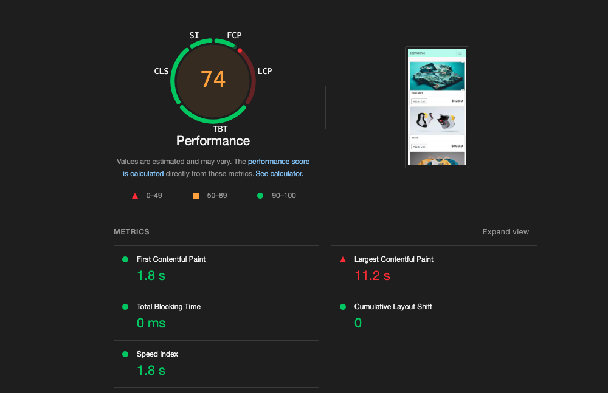
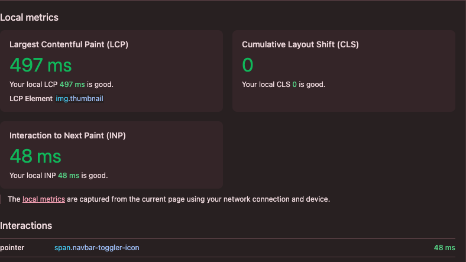
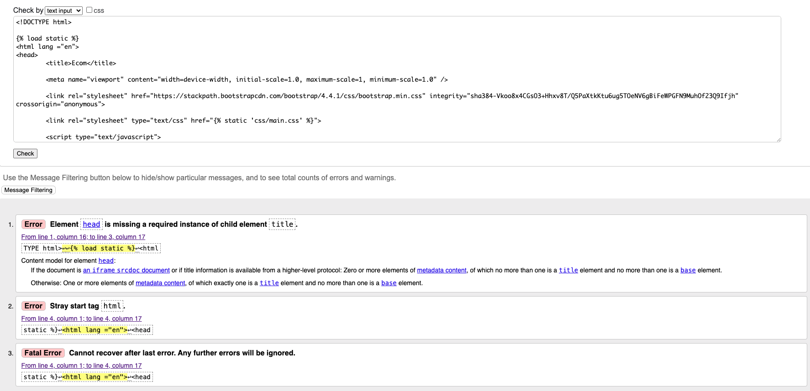
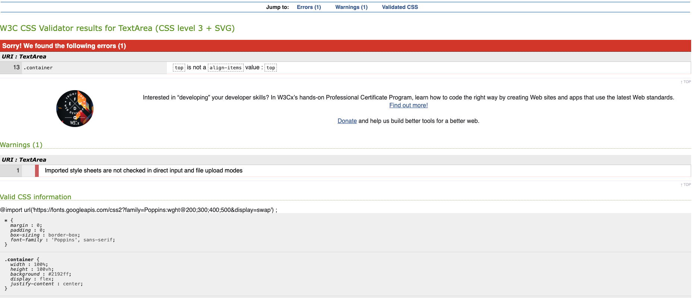
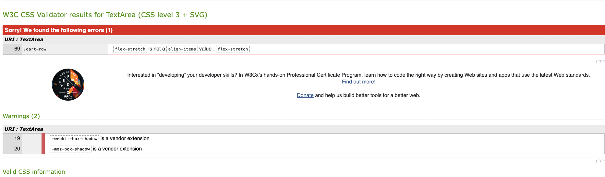
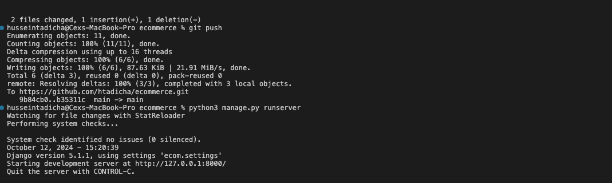

# Testing
Back to the [README](TESTING.md)

* Testing has taken place continuously throughout the development of the project. Each view was tested regularly. 
  When the outcome was not as expected, debugging took place at that point.  

### Python Validation - PEP
* Python testing was done using the PEP8 Online to ensure there were no syntax errors in the project. All python files
were entered into the online checker and no errors were found in any of the custom codes.

#### Tasty Blog - Posts

* [admin.py](./static/images/admins.pychecker.png)
* [apps.py](./static/images/apps.pychecker.png)
* [models.py](./static/images/models_testing.png)
* [forms.py](.static/images/loginform.pychecker.png)
* [urls.py](./static/images/urls.pychecker.pngg)
* [views.py](./static/images/views.pychecker.png)

### Lighthouse
Lighthouse was used to test Performance, Best Practices, Accessibility and SEO on Desktop.

##### Desktop Results:
.
.

### HTML Validation

HTML was validated using W3C Jigsaw validation service. only 3 warning were displayed and it is associated template we used to access our views which will not affect the html performance.

### CSS Validation

.
.
* Custom CSS was validated using W3C Jigsaw validation service. 2 warnings were displayed, however, relating to results of text area which will not affect the CSS performance.

### JavaScript Validation
.

### Console Results:
.
* The browser console is clean, no errors are  showing.

## Manual Testing

### Frontend

1. Store Page
- Test loading of the storepage: Verify that the storepage loads correctly with all the product images rendered correctly image, showing all the navigation and required details in color contrust.
- Check responsiveness: Test if the page adapts properly to different screen sizes (mobile, tablet, desktop).
2. Navbar
- Navigation Links: Test all the navbar links (Store,login, cart Sign Up) to ensure they redirect to the correct pages.
3. Product Display (Store Page)
- Product Listing: Ensure that products are displayed in a 3-row flexbox layout.
- Product name, Image and prices : Check if the images, names, and prices of the      products are displayed correctly.
- 'Add to Cart' Button: Test the functionality of the "Add to Cart" button to ensure products are added to the cart without refreshing the page.
- Empty Search Result: Conduct a search for a non-existing product and check if a "No results found" message is displayed.
4. Search Functionality
- Search for a product: Test the search bar by typing a product name to confirm relevant results are displayed.
- No Results Handling: Ensure that if no products match the query, a message is displayed ("No product found").
5. Cart System
- Add Products to Cart: Add multiple products to the cart and verify that the cart count updates in the navbar.
- Remove Products: Remove products from the cart and check if the count and total price update correctly.
- Cart redirects to the store with continue shopping button hperlinked to the store
- Cart Persistence: Refreshed the page and verified that the cart items are still intact.
- Checkout Flow: Proceeded to checkout and tested if the cart items are displayed correctly before submitting.
6. Login and Signup Pages
- Form Validation: Test for required fields, invalid inputs (e.g., wrong email format), and correct error messages.
- Successful Signup: Create a new account, ensured the form redirects to the store page after successful signup.
- Login Functionality: Log in with a registered account, ensuring a successful redirect to the store page.
- Invalid Credentials: Try logging in with wrong credentials and checked if an appropriate error message is shown. which is confirmed to be working
7. Form Validation (Front-End)
- Login and Signup Forms: Ensured real-time validation of input fields, such as email format.
8. Mobile Responsiveness
- Checked layout responsiveness: On various devices (phone, tablet), tested how the storepage, product listings, checkout page, cart and login and signup page and forms resize and reflow.
- Navbar: Ensure the navbar collapses properly into a hamburger menu on smaller screens.
- Forms and Buttons: Verified that all forms (login, signup, add to cart) remain usable and do not break on mobile devices.
9. Cross-Browser Testing
- Test on different browsers: Ensure that the site works seamlessly on major browsers (Chrome, Firefox, Safari, Edge).
- Check for styling issues: Look for any misalignments, font issues, or broken layouts in different browsers.
10. Error Messages and Feedback
- Error Handling: Simulate user errors (invalid input, missing required fields) and verify that user-friendly error messages are displayed.
- Success Messages: Ensure success messages are shown when actions like signup, login, and cart updates are successful. 

### Backend/Admin Panel

* I have tested the Admin Panel repeatedly since the start of the project development. All the models are working without issues.I have created, deleted, and updated data in all models without errors. The models have the behavior expected for what they were built for.

### Fixed Bug

* while i was developing the projects i went through the following bugs and was able to fix them with some help from peers and research.

1. NoReverseMatch for 'sign_up'
**Error:**
Reverse for 'sign_up' not found.
**Solution:**
Add the correct URL pattern for the 'sign_up' view in your urls.py file.
2. NameError: 'LoginForm' is not defined
**Error:**
The LoginForm class was not defined or imported.
**Solution:**
Define and import the LoginForm class in your views.py.
3. NameError: 'redirect' is not defined
**Error:**
The redirect function was not imported.
**Solution:**
Import the redirect function from Django.

4. CSRF Token Error
**Error:**
CSRF token from POST incorrect.
**Solution:**
Ensured the form includes the  tag to provide a valid CSRF token.

5. Login Not Redirecting After Successful Login
**Error:**
After login, the user was not redirected to the store page.
**Solution:**
Ensured the store URL is correctly named and referenced in the redirect function.

6. Search Query Not Showing 'No Results Found..'
**Error:**
No message was displayed when no products matched the search query.
**Solution:**
Added logic to display a "No results found" message when the search returns no products.

7. Incorrect Form Handling for Login and Signup
**Error:**
Login and signup forms did not handle validation correctly, causing login or signup failures.
**Solution:**
Ensured proper validation checks in the form handling logic before authentication or user creation.